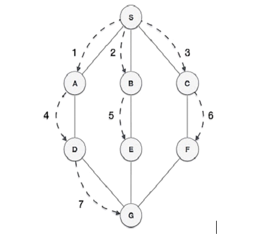
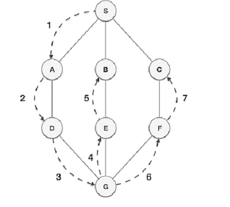

# Graph Data Structure
Graph data structures are data structures that consist of a collection of nodes or vertices connected by edges. Graphs are used to represent relationships or connections between objects and are widely used in various fields, including computer science, mathematics, social networks, and transportation systems.

## Types of graph
**Undirected Graph:** In an undirected graph, edges have no direction, and they represent symmetric relationships between nodes. If there is an edge between node A and node B, you can travel from A to B and from B to A.

**Directed Graph (Digraph):** In a directed graph, edges have a direction, indicating a one-way relationship between nodes. If there is an edge from node A to node B, you can travel from A to B but not necessarily from B to A.

**Weighted Graph:** In a weighted graph, edges have associated weights or costs. These weights can represent various attributes such as distance, cost, or capacity. Weighted graphs are commonly used in applications like route planning or network optimization.

**Cyclic Graph:** A cyclic graph contains at least one cycle, which is a path that starts and ends at the same node. In other words, you can traverse the graph and return to a previously visited node by following the edges.

**Acyclic Graph:** An acyclic graph, as the name suggests, does not contain any cycles. This type of graph is often used in scenarios where a cycle would be nonsensical or undesirable, such as representing dependencies between tasks or events.

**Tree:** A tree is a special type of acyclic graph where each node has a unique parent except for the root node, which has no parent. Trees have a hierarchical structure and are frequently used in data structures like binary trees or decision trees.

## Common applications of graph data structures
**Social Networks:** Social networks, such as Facebook or Twitter, can be represented as graphs. Nodes represent individuals, and edges represent connections or relationships between them. Graphs can be used to analyze social connections, recommend friends, identify communities, and study information diffusion.

**Transportation Networks:** Graphs are widely used to model transportation systems, such as road networks, airline routes, or public transportation. Nodes represent locations, and edges represent connections or routes between them. Graph algorithms can be employed for route planning, finding the shortest path, optimizing transportation networks, and analyzing traffic flow.

**Internet and Web Graphs:** The internet and the World Wide Web can be modeled as graphs. Websites are represented as nodes, and hyperlinks between websites are represented as edges. Graph algorithms can be used for web page ranking (e.g., Google's PageRank algorithm), web crawling, link analysis, and recommendation systems.

**Computer Networks:** Computer networks, including local area networks (LANs) and wide area networks (WANs), can be represented as graphs. Nodes represent devices (e.g., computers, routers), and edges represent connections between them. Graphs can be used for network optimization, routing protocols, network monitoring, and network security analysis.

**Recommendation Systems:** Graphs are used in recommendation systems to model user-item relationships. Nodes represent users and items, and edges represent interactions or preferences. Graph-based recommendation algorithms can analyze the graph structure to provide personalized recommendations, collaborative filtering, and item similarity analysis.

<hr>
<br>

## BFS and DFS traversal in Graph:

Both Breadth-First Search (BFS) and Depth-First Search (DFS) are traversal algorithms used to visit all the vertices in a graph. 

> BFS explores the graph in breadth-first order, visiting all the vertices at the same level before moving to the next level. It uses a queue data structure to store the vertices that need to be visited.

> DFS explores the graph in depth-first order, visiting a vertex and then recursively exploring its neighbors.
It uses a stack data structure or recursion to keep track of the vertices to be visited.

### BFS - Breadth-First Search 

Breadth-First Search (BFS) is a graph traversal algorithm that explores all the vertices of a graph in breadth-first order, i.e., it visits all the vertices at the same level before moving to the vertices at the next level. BFS starts from a specified source vertex and explores its neighbors first before moving to their neighbors.
```python
from collections import deque
def bfs(graph, start, search_value):
    visited = set()
    queue = deque([start])

    while queue:
        vertex = queue.popleft()
        if vertex == search_value:
            return True
        visited.add(vertex)
    
        for neighbour in graph[vertex]:
            if neighbour not in visited:
                queue.append(neighbour)
                visited.add(neighbour)
    return False

graph = {
    'A': ['B', 'C'],
    'B': ['A', 'D', 'E'],
    'C': ['A', 'F'],
    'D': ['B'],
    'E': ['B', 'F'],
    'F': ['C', 'E']
}

start = "F"
search_value = "B"
res = bfs(graph, start, search_value)
print(f"element {search_value} : {res}")

# output : element B : True
```
1. The code begins by importing the deque class from the collections module. A deque is used as the queue data structure in the BFS algorithm.

1. The bfs function is defined, which takes three parameters: graph, start, and search_value. The graph parameter represents the graph in the form of an adjacency list. The start parameter is the starting vertex for the BFS traversal. The search_value parameter is the value being searched for in the graph.

1. Inside the bfs function, a set called visited is created to keep track of visited vertices. The queue is initialized with the start vertex.

1. The while loop continues until the queue becomes empty, indicating that all vertices have been visited or that the search value has been found.

1. In each iteration of the while loop, a vertex is dequeued from the left side of the queue using the popleft() method.

1. If the dequeued vertex is equal to the search_value, it means the value has been found in the graph, so the function returns True.

1. If the search_value is not found, the vertex is marked as visited by adding it to the visited set.

1. The for loop iterates over each neighbor of the vertex by accessing the adjacency list graph[vertex].

1. If a neighbor is not already visited, it is appended to the queue and marked as visited.

1. If the while loop completes without finding the search_value, the function returns False.

1. The graph is defined using a dictionary where each key represents a vertex, and its corresponding value is a list of neighboring vertices.

1. The start and search_value variables are set to specify the starting vertex for the BFS traversal and the value being searched for, respectively.

1. The bfs function is called with the graph, start, and search_value arguments, and the result is stored in the res variable.

1. Finally, the result is printed, indicating whether the search_value was found in the graph or not.

### DFS - Depth-First Search

```python
def dfs(graph, start, search_value, visited = None):
    if visited is None:
        visited = set()
    
    if start == search_value:
        return True
    visited.add(start)

    for neighbour in graph[start]:
        if neighbour not in visited:
            found = dfs(graph, neighbour, search_value, visited)
            if found:
                return True
    return False
    


graph = {
    'A': ['B', 'C'],
    'B': ['A', 'D', 'E'],
    'C': ['A', 'F'],
    'D': ['B'],
    'E': ['B', 'F'],
    'F': ['C', 'E']
}

start = "F"
search_value = "Z"
res = dfs(graph, start, search_value)
print(f"element {search_value} : {res}")
```

1. The dfs function takes four parameters: graph, start, search_value, and visited. The graph parameter represents the graph in the form of an adjacency list. The start parameter is the starting vertex for the DFS traversal. The search_value parameter is the value being searched for in the graph. The visited parameter keeps track of visited vertices.

1. At the beginning of the dfs function, it checks if the visited set is None. If so, it initializes it as an empty set.

1. If the start vertex is equal to the search_value, it means the value has been found in the graph, so the function returns True.

1. If the search_value is not found, the start vertex is marked as visited by adding it to the visited set.

1. The for loop iterates over each neighbor of the start vertex by accessing the adjacency list graph[start].

1. If a neighbor is not already visited, the dfs function is recursively called on that neighbor, passing the graph, neighbour, search_value, and visited set as parameters.

1. If the recursive call returns True, it means the search_value has been found, so the function returns True.

1. If none of the neighbors leads to finding the search_value, the function returns False.

1. The graph is defined using a dictionary where each key represents a vertex, and its corresponding value is a list of neighboring vertices.

1. The start and search_value variables are set to specify the starting vertex for the DFS traversal and the value being searched for, respectively.

1. The dfs function is called with the graph, start, search_value, and visited arguments, and the result is stored in the res variable.

1. Finally, the result is printed, indicating whether the search_value was found in the graph or not.

<hr>
<br>